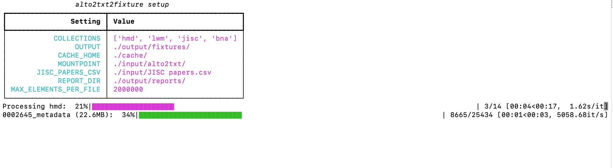

## Using `poetry` to run

The program should run automatically with the following command:

```sh
$ poetry run a2t2f-news
```

Alternatively, if you want to add optional parameters and don’t want to use the standard `poetry` script to run, you can use the (somewhat convoluted) `poetry run alto2txt2fixture/run.py` and provide any optional parameters. You can see a list of all the “Optional parameters” below. For example, if you want to only include the `hmd` collection:

```sh
$ poetry run alto2txt2fixture/run.py --collections hmd
```

## Alternative: Run the script without poetry

If you find yourself in trouble with `poetry`, the program should run perfectly fine on its own, assuming the dependencies are installed. The same command, then, would be:

```sh
$ python alto2txt2fixture/run.py --collections hmd
```

!!! note

    See the list under `[tool.poetry.dependencies]` in `pyproject.toml` for a list of dependencies that would need to be installed for `alto2txt2fixture` to work outside a python `poetry` environment.

## Optional parameters

The program has a number of optional parameters that you can choose to include or not. The table below describes each parameter, how to pass it to the program, and what its defaults are.

| Flag                  | Description                                                    | Default value                |
| --------------------- | -------------------------------------------------------------- | ---------------------------- |
| `-c`, `--collections` | Which collections to process in the mounted alto2txt directory | `hmd`, `lwm`, `jisc`, `bna`  |
| `-o`, `--output`      | Into which directory should the processed files be put?        | `./output/fixtures/`         |
| `-m`, `--mountpoint`  | Where is the alto2txt directories mounted?                     | `./input/alto2txt/`          |

## Successfully running the program: An example


